# ChefHero
#### Marketplace application - Caleb Leung

## 1 | The Problem 
Wasted potential is something everyone deals with whether it be potential in themselves or potential in the people around them. Wasted potential is usually accompanied by an unrequited passion that can sometimes seem unreachable as personal life matters, repsonsibilities get in many peoples ways of ever diving deep into that passion. 

One such passion is Cooking. Cooking is a hobby that only a few ever make a career out of, not because of lack of skill, but more so because of lack of knowhow. Knowhow of where to start such a career, large barriers to entry of starting up their own restaurant, and knowhow of the process it takes to share one's great food and dishes with the masses.
 
 

## 2 | The Solution
ChefHero provides the solution to hopefully capture all this wasted potential. ChefHero is a 2-way marketplace where anybody who believes their cooking skills are above average- a place to share/sell, and for customers to buy these dishes. 

For foodies, ChefHero is a platform to find great, high quality, homecooked meals from local ChefHeroes that before could not share their creations.

For inspiring chefs, ChefHero is a platform that finally gives them the ability to expore their cooking passion without the crazy high barriers to entry that a normal restaurant startup would face.  

ChefHero is community driven and functions on the shared passion for local homecooked meals that could definitely be competitive in quality with a Foodie's fine-dining alternative. 
 
 

## 3 | The Application
[Web Application](https://chefhero.herokuapp.com/) (https://chefhero.herokuapp.com/) 
[Github](https://github.com/calebleungg/chefhero) (https://github.com/calebleungg/chefhero)
 
 

## 4 | ChefHero - Ins and Outs

### 4.1 | Purpose
The purpose behind ChefHero is the facilitation of people who are passionate about food, who focus on the quality of the food experience, and of people who share a passion in creating/sharing home cooked food, a place to sell and share dishes created by inspiring chefs who want to experience/start a career in the food industry or for mums, dads, sons, daughters anyone who thinks their dish is worth sharing. 

A lower level purpose focusing on Foodies- ChefHero provides a marketplace where they can find locally, homecooked dishes that would not have been discoverable without the platform.

A lower level purpose focusing on chefs- ChefHero provides a platform with low barriers to entry, and an end-to-end management tool to list, manage, sell, and earn through their signature home dishes. 

### 4.2 | Funtionality & Features 

#### Search and Browse
- Home page displays top chefs and dishes for well earned recognition
- Dish listing page provides a simple display with search by name/category functions and sort/filtering options by orders and newest
- Chef listing page provides simple chef details with display image- and search by name functions with sort/filtering options by most orders and highest average rating

#### Order Tracking
- For customers- a detailed order history can be accessed through their profile details, with date filtering options
- Customers can access order details/summaries anytime to search directions, see order details, and to leave reviews for chefs

#### Public Profile
- General users have access to a public profile display where they can edit their user profile picture, about section details to portray a nice public facing portfolio.
- Users can access their Account page to have full edit abilities to their personal information (which isnt displayed on their public profile)

#### Favourites
- General users have the ability to favourite and bookmark their favourite chefs, which will be tracked through their account page

#### Notifications
ChefHero has a simple notification function with types as below:
- **New Dish** - Users who have favourited a chef will be notified when that chef creates a new dish
- **New Order** - Chefs will be notified when users place a new order
- **Order Ready** - Users will be notified when a dish has finished preparation and is ready to be collected
- **Review Request** - When a chef marks a dish as collected- users will be notified with a thanks, and a request to place a review for the chef.

#### Chef Dashboard
The chef dashboard is a resource only available for ChefHeroes, to manage the end-to-end process of selling their dishes

- **Manager** - Allows chefs to manage their address details and schedule. Manager also provides a section where chefs can edit, delist, and list their current dishes
- **Orders** - Orders is a order processiong section of the dashboard. Here a chef can track all incoming orders, and track all orders that are ready to be collected, and have been collected, with access to a full order history also. Order history display also provides date filtering options. 
- **Earnings** - The Earnings section allows Chefs to track their to-date earnings, with the ability to see all withdrawal transactions history- and to also request earnings withdrawals to their chosen bank account. 
- **Analytics** - Analytics provides a detailed breakdown of store operations to help deepen insight on a chef's dish/customer base.

#### Admin Controls
Chefhero provides standard site admin controls to monitor, change and delete any behaviours that are outside the scope of what is appropriate on the platform with a simple, all inclusive admin control panel. The panel also displays relevant site statistics for day to day operations. Through the panel, an admin can see all the users, dishes, orders, and reviews placed for the site, with deep search abilties by either name, email, id, dish name, dish category for most search queries for all models. 
 
 

### 4.3 | Sitemap
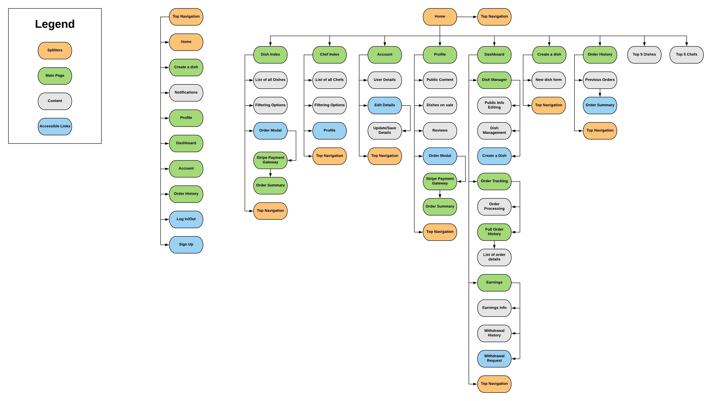

### 4.4 | Screenshots
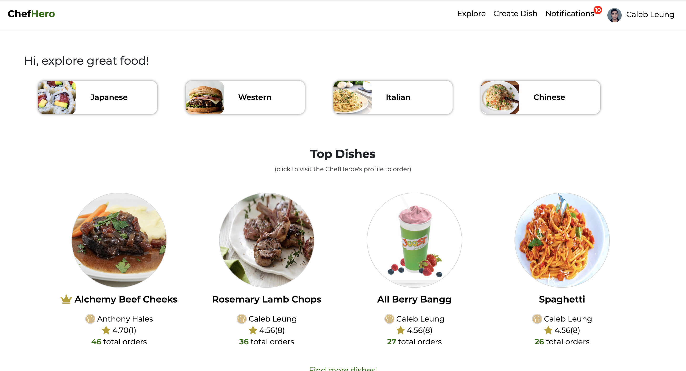
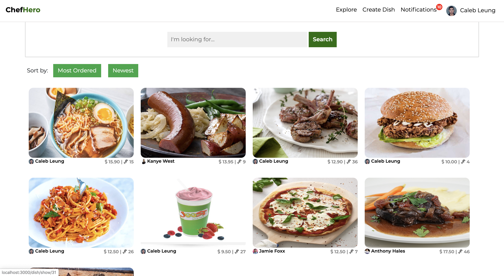
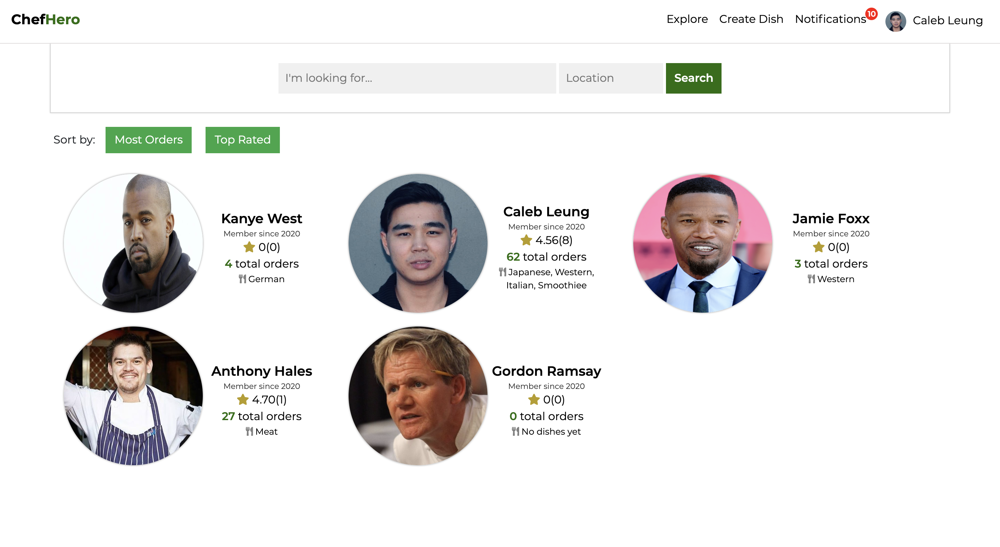
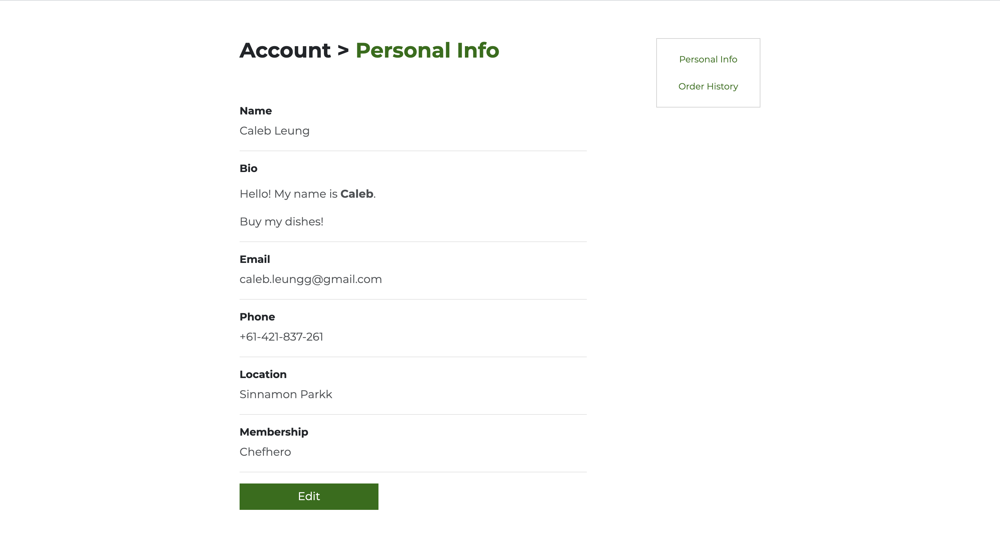
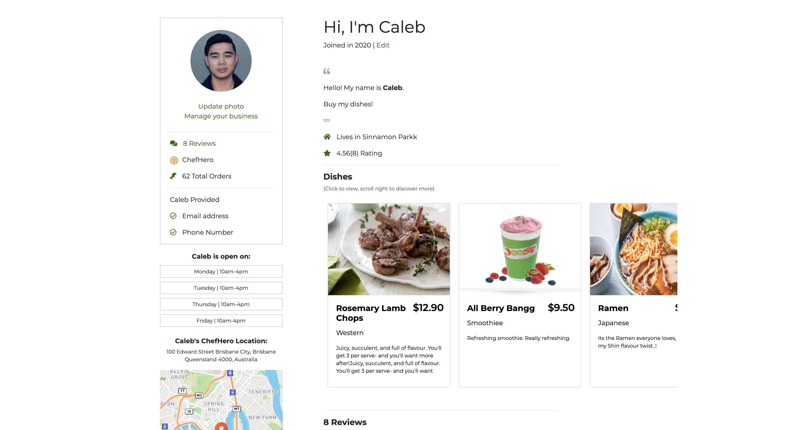
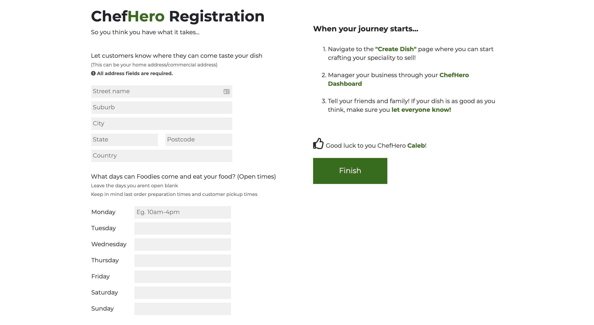
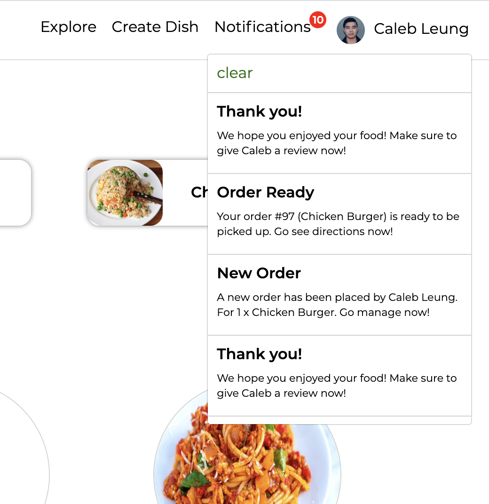
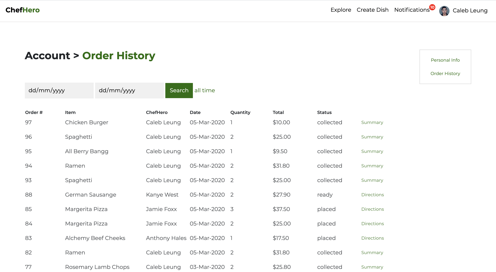
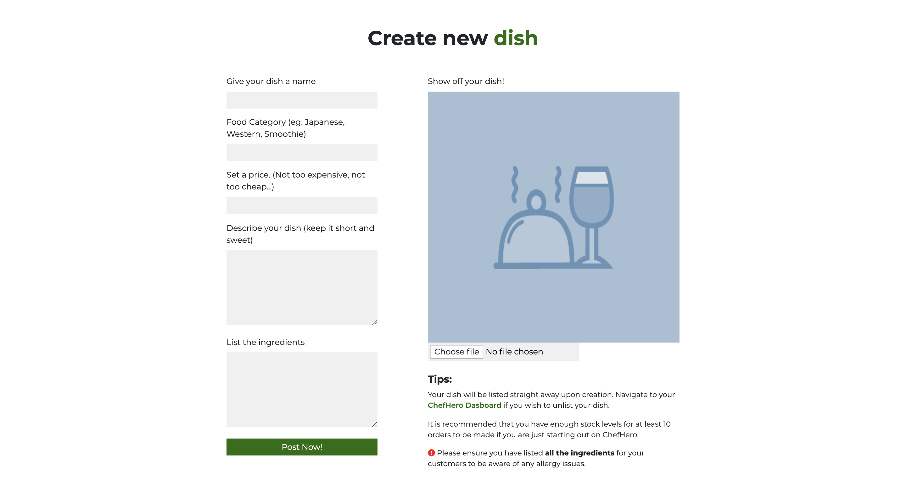
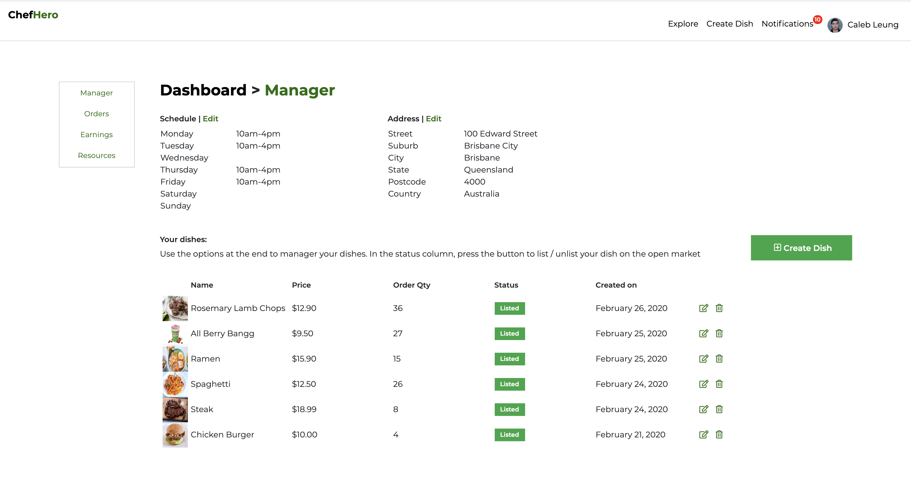

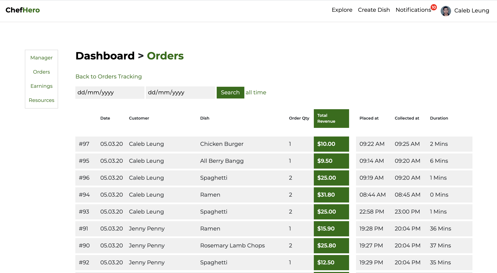
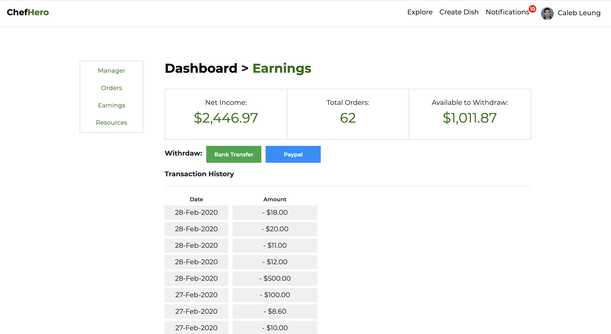

### 4.5 | Target Audience
ChefHero's main target audience is 2 fold.

1. **Customers** who are looking for good quality home cooked meals, who are willing to travel for the experience
2. **Home Chefs** who have a passion for cooking and want to share/start earning with their cuisine.

This audience base is one that is tried and tested in the Australian market, with proven demand as seen by the continuous popularity of shows such as My Kitchen Rules. There is a demographic of people in Australia that finds interest in testing their own culinary skills against other non-professional chefs, and with that a demographic who is earger and willing to travel for the experience of these passionate chefs to taste their dishes.

### 4.6 | Tech Stack
|Technologies||
| --- | --- |
|**Front-end**: |HTML, CSS, Sass, Bootstrap 
|**Back-end**:| Ruby on Rails 
|**Deployment**:| Heroku 
|**Active Storage**:| Amazon S3 
|**APIs**: |Stripe, Mapbox, TinyMCE
 
 